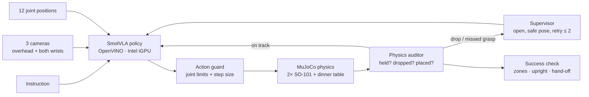

# RescueHands AI — a dinner table that survives a drop

**Two simulated SO-101 arms set a dinner place from a spoken instruction.** A fine-tuned
**SmolVLA** policy runs on an **Intel iGPU through OpenVINO**. A physics-aware
**supervisor** watches every step, catches real drops and missed grasps, and makes the
robot retry safely instead of carrying on blindly.

> A VLA should not be trusted just because it produced an action. Check what physically
> happened — and recover.

| In-air hand-off | Both grippers on the fork |
| --- | --- |
|  |  |
| **Gripper fault: the fork drops, the arms back off** | **Table set: fork left of the plate, cup right** |
|  |  |

<sub>Frames of the scripted demonstration teacher (seed 1), drawn from presentation
cameras with `scripts/render_showcase.py`. The learned-policy demo is in the video.</sub>

**Intel Physical AI Track · built on:** Intel Physical AI Studio · OpenVINO · SO-101 · MuJoCo · SmolVLA / LeRobot

---

## The task

"*Hand the spoon over to the left arm, then place the cup next to the plate.*"

1. The **right arm** picks the named utensil. Fork and spoon lie in random order, so the words decide which one.
2. It passes the utensil to the **left arm in the air**.
3. The left arm places it beside the plate, and the right arm places the cup.

Every seed changes positions, sizes, mass, lighting and table colour. Grasps are real
contacts: nothing is welded or teleported.

## Architecture



- **The policy sees only** camera images, joint positions and the instruction.
- **Ground truth is kept apart:** object poses and contacts are used only by the
  auditor, the success check and the demonstration teacher.
- **No inverse kinematics in deployment:** SmolVLA outputs the 12 joint targets. IK
  exists only in the scripted teacher that makes training data.

## Workload placement

| Workload | Where | Why |
| --- | --- | --- |
| Demonstration generation (569 episodes, 3 cameras) | Kaggle Tesla T4, rendering through EGL on the GPU | CPU rendering took 229 s per episode; GPU rendering 14 s |
| SmolVLA fine-tuning (fp16 autocast) | Kaggle Tesla T4 | 1.5 s/step; Intel does not provide training hardware |
| OpenVINO export (Intel Physical AI Studio) | Kaggle CPU (195 s), reproduced on the Intel laptop | Weights byte-identical on both machines (`smolvla.bin` SHA-256 `778f9b55…`) |
| **Policy inference + simulation + supervisor + evaluation** | **Intel Core i5-6300U + Intel HD Graphics 520** | Organizer rule: the policy runs on Intel hardware |

## Hardware optimization choices

- **OpenVINO on the Intel iGPU:** 50-action chunks in **4.53 s mean** (p95 5.26 s,
  341 calls, measured during the v2 evaluation). The same trained model ran at
  about 190 s per chunk in PyTorch on the laptop CPU (v1 smoke benchmark, laptop under
  load: `results/audit_c1_benchmark_smoke`).
- **Action chunking:** 25 of each 50 predicted actions are executed before the next
  inference, so the slow step runs once per 1.25 s of robot time.
- **Rendering without shadows** for the policy cameras: 6× faster offscreen rendering
  on the iGPU, with the same setting in training and deployment.
- **Model contracts:** every checkpoint and export carries its joint order, camera map,
  control rate and file hashes, and inference refuses a mismatch.

## Results (10 randomized seeds, 0–9)

| Policy | Supervisor | Gripper fault | Full success | Notes |
| --- | --- | --- | ---: | --- |
| Scripted teacher (baseline) | on | — | 8/10 | |
| Scripted teacher (baseline) | off | yes | 2/10 | |
| Scripted teacher (baseline) | on | yes | **7/10** | supervisor turns 2 into 7 |
| **SmolVLA v2 · OpenVINO iGPU** | on | yes | **1/10** | hand-off completed in 4/10, utensil placed 4/10, cup placed 2/10; seed 4 recovered from a real drop and set the table |
| SmolVLA v2 · OpenVINO iGPU | off | yes | running | same seeds and fault, supervisor off — the matched comparison |

**What the learned result shows:**
- **The safety loop works.** Every drop and every missed grasp was detected, labelled
  and followed by a safe retry.
- **The learned grasp is not yet reliable.** In the failed seeds the utensil
  rose at most 1.1 cm, compared with 8.7 cm in the success.
- **Likely cause: too little training on the new data.** v2 saw each new
  demonstration frame 0.28 times on average (6,000 steps × 16 over 336,729 frames).

Every number comes from committed files in `results/`, each with a `manifest.json`
recording the code revision, arguments and package versions.

**Honest limits:**
- Collision checks cover arm-to-arm contact only.
- Randomized item friction does not reach the jaw contacts.
- Simulation pauses during inference, so this is not real-time 20 Hz control.
- The spare-utensil check looks at the final state only.

## Models and data

| | |
| --- | --- |
| Fine-tuned policy | [ABDHAM/smolvla_rescuehands_v2](https://huggingface.co/ABDHAM/smolvla_rescuehands_v2), plus its OpenVINO export in `openvino_fp32/` |
| Dataset (569 episodes, 336,729 frames) | [ABDHAM/rescuehands_table_v2](https://huggingface.co/datasets/ABDHAM/rescuehands_table_v2) (commit `ca9e5592`) |
| v1 policy / dataset | [ABDHAM/smolvla_rescuehands](https://huggingface.co/ABDHAM/smolvla_rescuehands) / [ABDHAM/rescuehands_table](https://huggingface.co/datasets/ABDHAM/rescuehands_table) |

## Reproduce

Requires Python 3.12 and [uv](https://docs.astral.sh/uv/). Commands use Git Bash on Windows.

```bash
# 1. simulation environment + SO-101 model (Apache-2.0, pinned revision)
UV_PROJECT_ENVIRONMENT=.venv-sim uv sync --frozen --python 3.12
git clone --filter=blob:none --sparse https://github.com/google-deepmind/mujoco_menagerie.git .cache/menagerie
git -C .cache/menagerie sparse-checkout set robotstudio_so101
git -C .cache/menagerie checkout 8161bba264d7fa7c99ca301e91e7fb44737676ad

# 2. tests (100 unit and physics tests) and the scripted baseline
PYTHONPATH=src .venv-sim/Scripts/python.exe -m unittest discover -s tests
PYTHONPATH=src .venv-sim/Scripts/python.exe scripts/evaluate.py --policy scripted --seeds 0:10 --supervisor on --fault glitch

# 3. Intel environment (Physical AI Studio + OpenVINO)
uv venv .venv-pai --python 3.12
uv pip install --python .venv-pai/Scripts/python.exe --extra-index-url https://download.pytorch.org/whl/cpu \
  "physicalai-train[smolvla,cpu]==0.1.0" "lerobot[dataset]==0.5.1" "transformers==5.3.0" nncf mujoco==3.13.0 imageio psutil

# 4. fetch the OpenVINO export (hash-checked) and run the learned policy on the Intel iGPU
bash scripts/deploy_learned.sh ABDHAM/smolvla_rescuehands_v2 v2 fetch-export eval

# 5. retrain from scratch on a Kaggle GPU notebook (optional)
python training/kaggle_pipeline.py --hf-user <you> --stage setup
bash training/kaggle_gpu_render.sh
python training/kaggle_pipeline.py --hf-user <you> --stage data --episodes 200 --perturbed-episodes 200 --recovery-episodes 100
python training/kaggle_pipeline.py --hf-user <you> --stage train --steps 6000 --lr 5e-5 --init-from ABDHAM/smolvla_rescuehands
python training/kaggle_pipeline.py --hf-user <you> --stage export
```

## Repository map

| Path | What it does |
| --- | --- |
| `src/rescuehandsai/` | Scene, simulation, auditor, supervisor/runner, success rules, contracts, policies |
| `training/` | Kaggle pipeline: data, fine-tuning, verification, OpenVINO export |
| `scripts/` | `evaluate.py`, `benchmark_intel.py`, `deploy_learned.sh`, `render_showcase.py`, `export_openvino.py` |
| `results/` | Committed evidence behind every number |
| `docs/submission/` | Write-up, slides, cover |
| `docs/research/` | Independent audits and how they were resolved |

## License

Project code: MIT. SO-101 model: Apache-2.0, from google-deepmind/mujoco_menagerie
(downloaded separately). Table items are primitive shapes made for this project.
