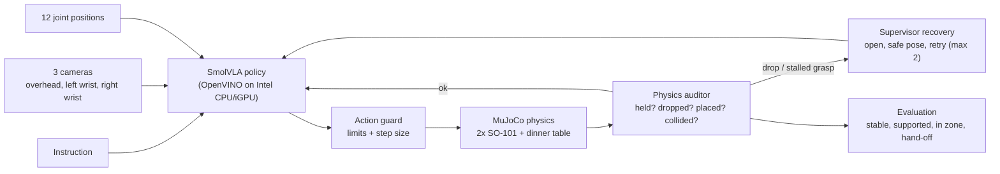

# RescueHands AI — a dinner table that survives a dropped fork

Two simulated SO-101 arms in MuJoCo set a dinner place from a spoken-style
instruction: the right arm picks the **named** utensil (fork or spoon), hands
it to the left arm, the left arm places it beside the plate, and the right arm
places the cup. A deterministic, physics-aware **supervisor** watches every
control step. When an item really drops, it stops, moves both arms to safety
and lets the policy try again, instead of blindly continuing.

> **Thesis:** a VLA should not be trusted just because it produced an action.
> A useful bimanual system checks what physically happened and recovers safely.

Built for the Intel **Bimanual VLA Manipulation** online track (AI Infra Summit
Hackathon 2026). Status: **work in progress** — see [Results](#results) for what
is measured and what is still pending.

## What makes it different

| | |
| --- | --- |
| Real two-arm teamwork | An in-air hand-off; both arms must hold the utensil for success. |
| Language matters | Fork *and* spoon lie on the mat in random order; only the instruction says which one. |
| Honest physics | Contact grasps only. No welding, no teleporting. Success is measured from simulator state, never from the policy's claim. |
| Failure awareness | Auditor labels `OBJECT_DROPPED`, `FAILED_GRASP`, `COLLISION`, `TIMEOUT`… plus a progress watchdog for grasps that never start. |
| Bounded recovery | Open, retreat to a safe pose, retry — at most twice. |
| Intel deployment | SmolVLA exported with Intel Physical AI Studio to OpenVINO and run on an Intel CPU and iGPU. |

## Architecture



Policy-visible data: camera images, joint positions, instruction. Simulator
ground truth (object poses, contacts) is used only by the auditor, the
evaluation and the scripted teacher — never as policy input.

### Where inverse kinematics is used

Only inside the **scripted teacher** (`expert.py`), which generates the training
demonstrations and serves as the baseline row. At deployment, SmolVLA outputs
the 12 joint targets directly; there is no IK in the learned control loop.

## Results

All numbers come from files under `results/` produced by `scripts/evaluate.py`
and `scripts/benchmark_intel.py`. Evaluation seeds 0–9 are never used for training
data (training seeds start at 1000).

### Task success on 10 randomized seeds

Each seed randomizes item positions, cup size, mass, friction, utensil size and
order, lighting and table colour. "Gripper glitch" forces the holding hand open
for 0.5 s after the utensil is lifted (a real physical drop).

| Policy | Supervisor | Fault | Success | Notes |
| --- | --- | --- | ---: | --- |
| Scripted teacher (baseline) | on | none | 8/10 | 2 failures: one planning error, one recovery budget exhausted |
| Scripted teacher (baseline) | off | gripper glitch | 0/10 | every drop breaks the task |
| Scripted teacher (baseline) | on | gripper glitch | pending | |
| SmolVLA (OpenVINO, iGPU) | off | none | pending | |
| SmolVLA (OpenVINO, iGPU) | on | gripper glitch | pending | |

### Intel optimization

Pretrained SmolVLA spike (FP32, random inputs, before fine-tuning):

| Device | Mean per 50-step chunk |
| --- | ---: |
| Intel HD Graphics 520 iGPU (OpenVINO) | 4.68 s |
| Intel Core i5-6300U CPU (OpenVINO) | 30.8 s (measured under CPU contention; re-measurement pending) |

The final benchmark (`scripts/benchmark_intel.py`) compares PyTorch CPU,
OpenVINO FP32 on CPU, FP32/FP16 execution on the iGPU, NNCF INT8 weights and
model caching, each with its action difference from the FP32 reference.
**Pending** on the fine-tuned model. Simulation time pauses during inference;
latency is reported separately as wall-clock time.

### Hardware statement

Organizers allowed other Intel platforms when optimizations are documented. The
demo and benchmarks run on an **Intel Core i5-6300U with Intel HD Graphics 520**
(not Core Ultra). Training and bulk data generation used a cloud GPU, which the
challenge allows. No Core Ultra numbers are claimed.

## Reproduce

Requires Python 3.12 and [uv](https://docs.astral.sh/uv/). Three environments
are kept separate because their dependencies conflict:

| Env | Purpose | Key packages |
| --- | --- | --- |
| `.venv-sim` | simulation, teacher, tests, scripted evaluation | MuJoCo 3.13.0 |
| `.venv-pai` | data recording, export, SmolVLA inference, benchmark | Physical AI Studio 0.1.0, LeRobot 0.5.1, OpenVINO 2026.1, NNCF |
| Kaggle `.venv-train` | GPU data generation and SmolVLA fine-tuning | LeRobot 0.5.1 |

```bash
# 1. core environment (Windows: use your standalone Python 3.12 path)
UV_PROJECT_ENVIRONMENT=.venv-sim uv sync --frozen --python 3.12

# 2. SO-101 model (Apache-2.0, pinned revision)
git clone --filter=blob:none --sparse https://github.com/google-deepmind/mujoco_menagerie.git .cache/menagerie
git -C .cache/menagerie sparse-checkout set robotstudio_so101
git -C .cache/menagerie checkout 8161bba264d7fa7c99ca301e91e7fb44737676ad

# 3. tests (50+ unit and physics tests)
.venv-sim/Scripts/python.exe -m unittest discover -s tests -v

# 4. watch the teacher live, with a dropped utensil and recovery
PYTHONPATH=src .venv-sim/Scripts/python.exe scripts/watch.py --seed 0 --fault glitch

# 5. scripted baseline on the 10 evaluation seeds
PYTHONPATH=src .venv-sim/Scripts/python.exe scripts/evaluate.py --policy scripted --seeds 0:10 --supervisor on --fault glitch

# 6. Physical AI Studio environment
uv venv .venv-pai --python 3.12
uv pip install --python .venv-pai/Scripts/python.exe --extra-index-url https://download.pytorch.org/whl/cpu \
  "physicalai-train[smolvla,cpu]==0.1.0" "lerobot[dataset]==0.5.1" "transformers==5.3.0" nncf mujoco==3.13.0 imageio psutil

# 7. data + training on a Kaggle GPU notebook (Internet on, HF_TOKEN secret)
python training/kaggle_pipeline.py --hf-user <you> --episodes 120 --steps 12000

# 8. export to OpenVINO, evaluate on the iGPU, benchmark
PYTHONPATH=src .venv-pai/Scripts/python.exe scripts/export_openvino.py --checkpoint <you>/smolvla_rescuehands --out models/openvino/fp32
PYTHONPATH=src .venv-pai/Scripts/python.exe scripts/evaluate.py --policy smolvla --export models/openvino/fp32 --device GPU --seeds 0:10 --supervisor on --fault glitch --video
PYTHONPATH=src .venv-pai/Scripts/python.exe scripts/benchmark_intel.py --export models/openvino/fp32
```

## Project layout

| Path | Responsibility |
| --- | --- |
| `src/rescuehandsai/scene.py` | Seeded dinner-table MJCF: table, plate, mats, cup, fork, spoon, lights, cameras |
| `src/rescuehandsai/sim.py` | The only module that owns MuJoCo state; named joints, cameras, fault injection |
| `src/rescuehandsai/control.py` | Rejects wrong names, non-finite values, stale commands, limit and step violations |
| `src/rescuehandsai/auditor.py` | Physics facts (held by both jaws, supported, zones, collisions) and debounced failure events |
| `src/rescuehandsai/runner.py` | Episode state machine, action guard, supervisor, recovery, progress watchdog |
| `src/rescuehandsai/evaluation.py` | Physical task success: in zone, supported, upright, released, settled, hand-off, spare utensil in place |
| `src/rescuehandsai/expert.py`, `kinematics.py`, `motion.py` | Scripted teacher (IK, contact grasps, hand-off) for data and baseline |
| `src/rescuehandsai/perturb.py` | Seeded gripper-glitch fault |
| `src/rescuehandsai/recorder.py`, `scripts/generate_dataset.py` | LeRobot dataset recording (successful episodes only) |
| `src/rescuehandsai/policies/` | Scripted and exported-SmolVLA policies behind one contract |
| `training/kaggle_pipeline.py` | GPU data generation and SmolVLA fine-tuning |
| `scripts/evaluate.py`, `scripts/benchmark_intel.py` | Seeded evaluation with videos; Intel benchmark |
| `docs/` | Research review, design spec, plan, OpenVINO spike findings |

## Design notes learned by measurement

- A straight-down SO-101 hand has only ~8 cm of vertical travel mid-table, so
  the teacher grasps with the hand tilted 1.2–1.4 rad.
- The fixed jaw sits 2 cm off the fingertip frame; grasps aim it 5–8 mm outside
  the object and 7 mm below the handle centre, otherwise fingertips pinch an edge and slip.
- The wrist camera mount sticks out 6 cm; jaw directions are chosen per arm so
  the cameras never meet during the hand-off.
- Sideways pushes up to 15 N and a low-friction "slip" did not dislodge a held
  utensil, so recovery is tested with a gripper glitch that really drops it.
- Shadows made offscreen rendering 6× slower on the iGPU; they are off for both
  training data and deployment so the policy sees identical images.

## Licenses

Project code: MIT (see `LICENSE`). SO-101 model: Apache-2.0, from
google-deepmind/mujoco_menagerie (derived from TheRobotStudio SO-ARM100),
downloaded separately. Table items are primitive shapes created for this project.
