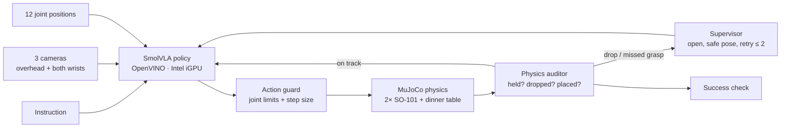

# RescueHands AI — a dinner table that survives a drop

Two simulated SO-101 robot arms in MuJoCo set a dinner place from a written instruction.
A fine-tuned **SmolVLA** policy runs on an **Intel iGPU through OpenVINO**. A physics-aware
**supervisor** checks every step, notices drops and stalls, and sends the arms back to a
safe pose to retry.

> **Status: research prototype, not a reliable robot.** The learned policy finished the
> full task in 1 of 30 valid test episodes. Its most common failure is picking up the
> wrong utensil. Work now focuses on a smaller skill first: pick up the *named* utensil
> and hold it (see [Current work](#current-work-pick-and-lift)).

| In-air hand-off | Both grippers on the fork |
| --- | --- |
|  |  |
| **Gripper fault: the fork drops, the arms back off** | **Table set: fork left of the plate, cup right** |
|  |  |

<sub>Frames from the scripted demonstration teacher (seed 1), made with `scripts/render_showcase.py`.</sub>

## The task

"*Hand the spoon over to the left arm, then place the cup next to the plate.*"

1. The right arm picks the named utensil (fork and spoon lie in random order).
2. It passes the utensil to the left arm in the air.
3. The left arm places it beside the plate; the right arm places the cup.

Every seed changes positions, sizes, mass, lighting and table colour. Grasps are real
contacts: nothing is welded or teleported.

## How it works



- The policy sees only camera images, joint positions and the instruction.
- Object poses and contacts (simulator truth) are used only by the auditor, the success
  check and the scripted teacher.
- No inverse kinematics at deployment: SmolVLA outputs the 12 joint targets. IK exists
  only inside the scripted teacher that makes training data.

Training runs on a Kaggle T4 GPU. Policy inference, simulation and evaluation run on an
Intel Core i5-6300U with Intel HD Graphics 520.

## Measured results (10 randomized seeds, 0–9)

| Policy | Supervisor | Gripper fault | Full success |
| --- | --- | --- | ---: |
| Scripted teacher (baseline) | on | none | 8/10 |
| Scripted teacher (baseline) | off | injected | 2/10 |
| Scripted teacher (baseline) | on | injected | 7/10 |
| SmolVLA v2 · OpenVINO iGPU | on | injected | 1/10 |
| SmolVLA v2 · OpenVINO iGPU | off | injected | 0/10 |
| SmolVLA v2 · OpenVINO iGPU | on | none | 0/10 |
| SmolVLA v2 · OpenVINO iGPU | off | none | invalid (renderer crashed before the first action; must be rerun) |

- OpenVINO on the iGPU: 50-action chunks in 4.53 s mean (p95 5.26 s, 341 calls). There is
  no fair PyTorch-vs-OpenVINO speed comparison yet.
- The learned policy lifted the requested utensil first in only 3 of 10 scenes.
- The three valid SmolVLA rows use the same 10 scenes, so they are not 30 independent tests.
- Raw result files are not stored in this repository. `scripts/evaluate.py` recreates them;
  each run writes a `manifest.json` with the code version, arguments and package versions.

## Current work: pick and lift

The right arm must pick up the utensil named in the instruction and hold it at least 5 cm
above the table for 1 second, without touching the spare utensil, the cup or the table.

- Physics version 3 adds MuJoCo's NoSlip solver so a held utensil no longer creeps out of
  the jaws.
- The pick-only teacher passed 16 of 16 development runs (4 scenes × 4 configurations),
  with no table contact. This is a small development check, not the final test.
- Not finished: hold-tolerance and force calibration, the 100-episode teacher gate, new
  training data, retraining, and the final test on unseen scenes.

## Limitations

- The learned policy does not yet choose the named utensil reliably.
- Simulation pauses during inference, so this is not real-time 20 Hz control.
- The supervisor misses some failures (for example a wrong-object grasp).
- The force limit for severe contacts is not set yet.

## Setup

Needs Python 3.12 and [uv](https://docs.astral.sh/uv/). Commands use Git Bash on Windows.

```bash
# simulation environment + SO-101 model (Apache-2.0, pinned revision)
UV_PROJECT_ENVIRONMENT=.venv-sim uv sync --frozen --python 3.12
git clone --filter=blob:none --sparse https://github.com/google-deepmind/mujoco_menagerie.git .cache/menagerie
git -C .cache/menagerie sparse-checkout set robotstudio_so101
git -C .cache/menagerie checkout 8161bba264d7fa7c99ca301e91e7fb44737676ad

# Intel environment (Physical AI Studio + OpenVINO), only for the learned policy
uv venv .venv-pai --python 3.12
uv pip install --python .venv-pai/Scripts/python.exe --extra-index-url https://download.pytorch.org/whl/cpu \
  "physicalai-train[smolvla,cpu]==0.1.0" "lerobot[dataset]==0.5.1" "transformers==5.3.0" nncf mujoco==3.13.0 imageio psutil
```

## Usage

```bash
# tests
PYTHONPATH=src .venv-sim/Scripts/python.exe -m unittest discover -s tests

# scripted baseline on seeds 0-9 with the supervisor and an injected gripper fault
PYTHONPATH=src .venv-sim/Scripts/python.exe scripts/evaluate.py --policy scripted --seeds 0:10 --supervisor on --fault glitch

# pick-only teacher on the development scenes
PYTHONPATH=src .venv-sim/Scripts/python.exe scripts/measure_pick_teacher.py

# fetch the OpenVINO export (hash-checked) and run the learned policy on the Intel iGPU
bash scripts/deploy_learned.sh ABDHAM/smolvla_rescuehands_v2 v2 fetch-export eval

# retrain on a Kaggle GPU notebook (optional)
python training/kaggle_pipeline.py --hf-user <you> --stage setup
bash training/kaggle_gpu_render.sh
python training/kaggle_pipeline.py --hf-user <you> --stage data --episodes 200 --perturbed-episodes 200 --recovery-episodes 100
python training/kaggle_pipeline.py --hf-user <you> --stage train --steps 6000 --lr 5e-5 --init-from ABDHAM/smolvla_rescuehands
python training/kaggle_pipeline.py --hf-user <you> --stage export
```

## Models and data

| | |
| --- | --- |
| Fine-tuned policy | [ABDHAM/smolvla_rescuehands_v2](https://huggingface.co/ABDHAM/smolvla_rescuehands_v2) (OpenVINO export in `openvino_fp32/`) |
| Dataset (569 episodes) | [ABDHAM/rescuehands_table_v2](https://huggingface.co/datasets/ABDHAM/rescuehands_table_v2) |

## Repository map

| Path | What it holds |
| --- | --- |
| `src/rescuehandsai/` | Scene, simulation, auditor, supervisor, success rules, pick-and-lift judge, policies |
| `configs/` | Scene, simulation, pick rules, contact lists, seed blocks |
| `scripts/` | Evaluation, benchmarks, measurements, OpenVINO export, rendering |
| `training/` | Kaggle pipeline: data, fine-tuning, checks, export |
| `tests/` | Unit and physics tests |
| `assets/` | Where the SO-101 model comes from |
| `docs/media/` | README pictures |

## License

Project code: MIT. SO-101 model: Apache-2.0, from google-deepmind/mujoco_menagerie
(downloaded separately). Table items are simple shapes made for this project.
